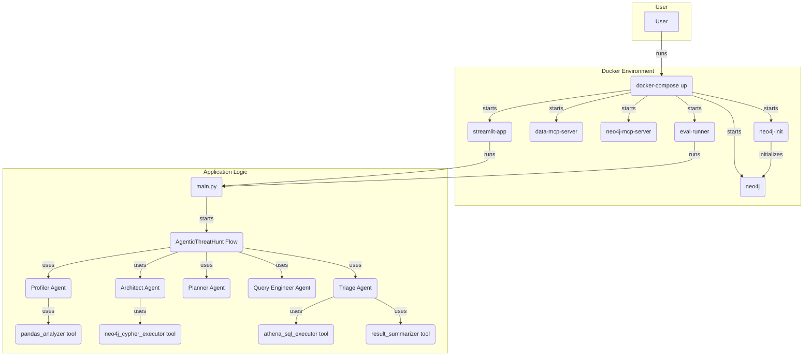

# AI Threat Hunting - Query Generation System
 An AI-powered query generation system that translates threat hunting hypotheses into executable queries against security log datasets.

# Agentic AI Threat Hunter (AWS CloudTrail)

This project implements an agentic AI solution for automated threat hunting. It utilizes a **GraphRAG (Knowledge Graph + Retrieval-Augmented Generation)** approach to translate high-level security hypotheses into executable SQL/Athena queries against AWS CloudTrail datasets.

## 1. Setup Instructions

To get started with the AI Threat Hunting - Query Generation System, please follow the steps below.

### Prerequisites
*   **Python 3.12**
*   **Neo4j** (Local instance or Neo4j Aura)
*   **OpenAI API Key** (or Gemini/Claude equivalent)

### Installation
1.  **Clone the repository:**
    ```bash
    git clone https://github.com/your-repo/agentic-threat-hunter.git
    ```
2.  **Install requirements:**
    ```bash
    pip install -r requirements.txt
    ```
    **Key Requirements**: `crewai`, `neo4j`, `pandas`, `pydantic`, `duckdb`, `openai`.

3.  **Configure Environment:** 
    
    Create a `.env` file in the root directory and populate it with your API key and Neo4j credentials:
    ```bash
    OPENAI_API_KEY=your_key_here
    NEO4J_URI=bolt://localhost:7687
    NEO4J_USER=neo4j
    NEO4J_PASSWORD=your_password
    ```
    For Docker-based setup, refer to the [Docker (optional)](#docker-optional) section.

## Architecture Overview

The system employs a sophisticated Multi-Agent System (MAS) orchestrated by CrewAI Flows, following a rigorous Plan-Execute-Verify cycle. The core of this architecture is designed to translate high-level threat hunting hypotheses into actionable queries against security log datasets. For a more in-depth explanation of the architectural approach, refer to the [Approach Document](docs/APPROACH.md).

The system's components are primarily deployed using Docker and orchestrated via `docker-compose`, providing a reproducible development and execution environment. Key services include:

*   **Streamlit Application (`streamlit-app`)**: Serves as the interactive user interface, allowing users to select hypotheses and visualize the agents' real-time activity and hunt results.
*   **Evaluation Runner (`eval-runner`)**: An automated service that executes predefined threat hunts for evaluation and reporting.
*   **Microservice Communication Protocol (MCP) Servers**:
    *   **`data-mcp-server`**: Provides data profiling and query execution functionalities, interacting with data sources like DuckDB.
    *   **`neo4j-mcp-server`**: Enables the Architect agent to interact with and dynamically update the Neo4j knowledge graph schema.
*   **Neo4j Database (`neo4j`)**: The central knowledge graph storing security ontology and schema information.

**Agentic Workflow Highlights:**

*   **Hypothesis Input**: Threat hunting hypotheses are fed into the system (e.g., via the Streamlit app or evaluation runner).
*   **Knowledge Graph (KG) Lookup**: Instead of guessing, agents query the Neo4j Knowledge Graph (via `neo4j-mcp-server`) to retrieve accurate AWS event names and field mappings.
*   **Query Generation**: A specialized Query Engineer agent uses the KG context to generate precise SQL/Athena queries.
*   **Execution**: An Execution Agent runs these queries against the CloudTrail logs (via `data-mcp-server`).
*   **Verification & Self-Correction**: A Triage Agent reviews the query results. If results are zero, noisy, or indicate syntax errors, it triggers a "Self-Correction" loop, guiding other agents to refine the hypothesis or query.

**Notes**: The Large Language Model (LLM) never directly accesses raw log data, ensuring data privacy. Instead, it operates on schema and ontology context provided by the Knowledge Graph. The orchestrator manages complex planning and verification loops.


## Mermaid Diagram (renderable)

If your markdown renderer supports Mermaid, you can view an interactive diagram below. The source for this diagram can be found at [docs/architecture.mmd](docs/architecture.mmd).



## Docker (optional)

For an easy, reproducible development and execution environment, you can use Docker and `docker-compose`.

### Dockerfile Details

The `Dockerfile` defines the base image and environment for all services:
*   Uses `python:3.12-slim-bookworm` as the base image.
*   Sets the working directory to `/app`.
*   Creates a Python virtual environment (`/opt/venv`) and configures `PATH` to use it.
*   Installs system-level build tools (e.g., `build-essential`) for Python package compilation.
*   Installs all Python dependencies listed in `requirements.txt` into the virtual environment.
*   Copies the entire project directory into the container.

### Docker Compose Services (`docker-compose.yml`)

The `docker-compose.yml` file orchestrates several interconnected services:

1.  **`data-mcp-server`**:
    *   **Purpose**: Runs the `src/mcp_data_server.py`, which provides data profiling and query execution capabilities (e.g., via DuckDB).
    *   **Configuration**:
        *   Exposes port `5001`.
        *   Reads data from `dataset/nineteenFeaturesDf.csv` (configurable via `CSV_PATH` environment variable).
        *   Includes a health check to ensure the server is ready.

2.  **`neo4j-mcp-server`**:
    *   **Purpose**: Runs the `src/neo4j_mcp_server.py`, enabling the Architect agent to interact with and update the Neo4j knowledge graph schema.
    *   **Configuration**:
        *   Exposes port `5002`.
        *   `NEO4J_READ_ONLY` is set to `"false"` to allow schema modifications.
        *   Includes a health check to ensure the server is ready.

3.  **`streamlit-app`**:
    *   **Purpose**: Hosts the interactive Streamlit user interface (`frontend/streamlit_app.py`) for initiating and monitoring threat hunts.
    *   **Configuration**:
        *   Exposes port `8501`.
        *   **Dependencies**: Depends on both `data-mcp-server` and `neo4j-mcp-server` being healthy before starting, ensuring agents have access to necessary services.
        *   Connects to MCP servers via `DATA_MCP_HOST`, `DATA_MCP_PORT`, `NEO4J_MCP_HOST`, and `NEO4J_MCP_PORT` environment variables (which map to the service names and ports defined in `docker-compose.yml`).

4.  **`eval-runner`**:
    *   **Purpose**: Executes the evaluation suite (`evals/run_all_hunts.py`) to run automated threat hunts and generate reports.
    *   **Configuration**:
        *   **Dependencies**: Also depends on `data-mcp-server` and `neo4j-mcp-server` being healthy.
        *   Connects to MCP servers using similar environment variables as `streamlit-app`.

5.  **`neo4j`**:
    *   **Purpose**: The Neo4j graph database instance.
    *   **Configuration**:
        *   Standard Neo4j Docker image.
        *   Persists data in a Docker volume.

6.  **`neo4j-init`**:
    *   **Purpose**: A one-off service to initialize the Neo4j database with the ontology defined in `scripts/neo4j/init_ontology.cql`.
    *   **Configuration**:
        *   Runs `cypher-shell` to execute the CQL script.
        *   **Dependencies**: Depends on the `neo4j` service being up.

All services configured in `docker-compose.yml` share a common network, allowing them to communicate using their service names as hostnames (e.g., `data-mcp-server`, `neo4j-mcp-server`). Additionally, local code changes are mounted into the containers (`.:/app`) for a seamless development experience.

### Quick Start with Docker

1.  **Create a `.env` file**: In the repository root, create a `.env` file containing your secrets and configurations:
    ```bash
    OPENAI_API_KEY=your_key_here
    NEO4J_URI=bolt://neo4j:7687 # Use 'neo4j' as hostname for Docker
    NEO4J_USER=neo4j
    NEO4J_PASSWORD=your_password
    CSV_PATH=dataset/nineteenFeaturesDf.csv # Path to your dataset within the container
    ```

2.  **Initialize Neo4j (if not already running)**:
    ```bash
    docker-compose up -d neo4j
    docker-compose run --rm neo4j-init
    ```

3.  **Build and Start Services**:
    *   **To start the Streamlit app (and dependent MCP servers)**:
        ```bash
        docker-compose up --build streamlit-app
        ```
        Your Streamlit app will be available at `http://localhost:8501`.
    *   **To run the evaluation job once**:
        ```bash
        docker-compose up --build eval-runner
        ```

4.  **Interactive Shell**: To open an interactive shell in the `streamlit-app` (or any other) container:
    ```bash
    docker-compose run --rm streamlit-app bash
    ```

Each MCP stub can be exposed via a TCP port (configured by `MCP_TCP_PORT` in the compose file). The `data-mcp` service listens on port 5001 and `neo4j-mcp` listens on 5002 by default and can be queried using a single-line JSON protocol (send a JSON request ending with a newline, receive a JSON response).

## Streamlit Frontend (Interactive UI)

An interactive Streamlit application is provided to allow users to easily kick off threat hunts, select hypotheses, and visualize the agent's thought process and results.

### Features:
*   **Hypothesis Selection**: Choose from a predefined list of threat hunting hypotheses.
*   **Live Agent Activity Log**: View real-time logs of the agents' reasoning process, including EDA summaries, KG construction, query generation, and verification steps.
*   **Structured Findings Display**: See the final generated SQL query, the agent's interpretation of the hypothesis, reasoning, assumptions made, and a confidence score for the hunt results.
*   **Hunt Metrics**: Track retry counts and confidence scores for each hunt.

### How to Run:
1.  Ensure all [Setup Instructions](#1-setup-instructions) are completed.
2.  Navigate to the project's root directory in your terminal.
3.  Run the Streamlit application:
    ```bash
    streamlit run frontend/streamlit_app.py
    ```
4.  Your browser will automatically open to the Streamlit app (usually `http://localhost:8501`).

**[Watch a demo video here](https://youtu.be/b7iFoWwEAT4)**

## Design Decisions and Trade-offs
For a deeper dive into the thought process behind this project, including specific challenges encountered and explainability considerations, please refer to:
*   [Challenges Faced](docs/CHALLENGES_FACED.md)
*   [Explainability](docs/EXPLAINABILITY.md)

**GraphRAG vs Vector RAG:** I chose GraphRAG because security log schemas are relational. Vector similarity is poor at distinguishing between nearly identical AWS API calls; a Graph provides strict schema enforcement.

**Stateful Orchestration**: I use CrewAI Flows to allow the agent to "loop back." If a query for id_5 (Whoami Reconnaissance) fails, the agent can re-reason and check if the logs use a different version of the API.

**Decoupled Compute:** The LLM never sees the raw log data (privacy), only the schema. The actual data processing happens in your local SQL/Athena environment.

## How to Extend to Other Datasets
To adapt this for Azure Activity Logs or Okta Logs:

**Schema Mapping:** Create a new nodes/edges file in Neo4j reflecting the new log provider's schema (e.g., mapping "User" to Actor in Okta).

**Prompt Templates:** Update the Query Agent's few-shot examples to reflect the new syntax (e.g., KQL for Azure).

**Data Connector:** Add a new tool to the agent for the specific data source (e.g., a Splunk or Sentinel API tool).

## Advanced Features (planned / recommended)

- **Query optimization suggestions** — instrument queries with estimated cost and provide suggestions to add time-window constraints or limit projections when cost is high.
- **Multi-step reasoning** — when a hypothesis requires complex logic, generate multiple staged queries (e.g., identify candidate accounts, then pivot to resource creation) and orchestrate them as a plan.
- **Confidence scoring with explanations** — include per-query and per-result confidence scores and short natural-language explanations for why a result matched (e.g., matched suspicious userAgent patterns + AccessDenied errors).
- **Automated prompt improvement based on failures** — when the verification agent flags a failure mode (syntax, empty results, noisy results), automatically propose prompt/template adjustments and evaluate their effect in a controlled loop.

## References & Helpful Resources

Below are references and helpful resources used for this implementation:

1. https://www.reddit.com/r/cybersecurity/comments/1hy3bz5/anyone_using_ai_for_threat_hunting/
2. https://www.reddit.com/r/blueteamsec/comments/1kadw6z/using_an_llm_with_mcp_for_threat_hunting/
3. https://tierzerosecurity.co.nz/2025/04/29/mcp-llm.html
4. https://github.com/trendmicro/cloud-risk-assessment-agent
5. https://medium.com/@dylanhwilliams/utilizing-generative-ai-and-llms-to-automate-detection-writing-5e4ea074072e
6. https://www.streamalert.io/
7. https://www.youtube.com/watch?v=7JZrJ2K39wE
8. https://www.youtube.com/watch?v=IgKP25HFqFU
9. https://www.youtube.com/watch?v=IgKP25HFqFU
10. https://docs.crewai.com/en/concepts/flows