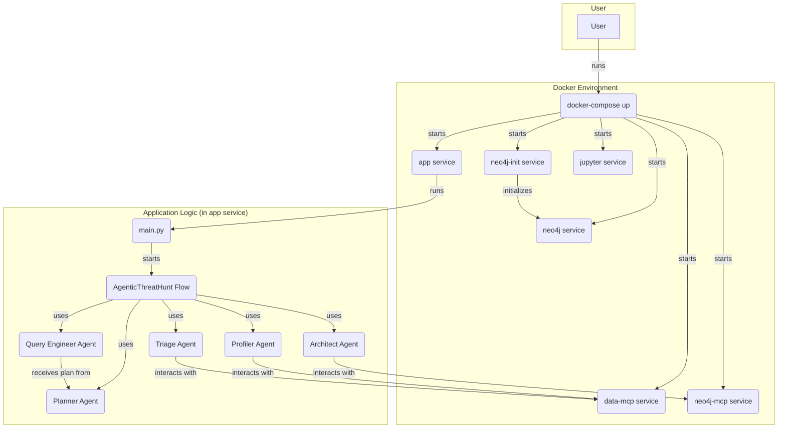

# AI Threat Hunting - Query Generation System
 An AI-powered query generation system that translates threat hunting hypotheses into executable queries against security log datasets.

# Agentic AI Threat Hunter (AWS CloudTrail)

This project implements an agentic AI solution for automated threat hunting. It utilizes a **GraphRAG (Knowledge Graph + Retrieval-Augmented Generation)** approach to translate high-level security hypotheses into executable SQL/Athena queries against AWS CloudTrail datasets.

## 1. Setup Instructions

To get started with the AI Threat Hunting - Query Generation System, please follow the steps below.

### Prerequisites
*   **Python 3.11**
*   **Neo4j** (Local instance or Neo4j Aura)
*   **OpenAI API Key** (or Gemini/Claude equivalent)

### Installation
1.  **Clone the repository:**
    ```bash
    git clone https://github.com/your-repo/agentic-threat-hunter.git
    cd agentic-threat-hunter
    ```
2.  **Install requirements:**
    ```bash
    pip install -r requirements.txt
    ```
    **Key Requirements**: `crewai`, `neo4j`, `pandas`, `pydantic`, `duckdb`, `openai`.

3.  **Configure Environment:** 
    
    Create a `.env` file in the root directory and populate it with your API key and Neo4j credentials:
    ```bash
    OPENAI_API_KEY=your_key_here
    NEO4J_URI=bolt://localhost:7687
    NEO4J_USER=neo4j
    NEO4J_PASSWORD=your_password
    ```
    For Docker-based setup, refer to the [Docker (optional)](#docker-optional) section.

## Architecture Overview
The system follows a Plan-Execute-Verify cycle using a Multi-Agent orchestrator (CrewAI Flows). For a more in-depth explanation of the architectural approach, refer to the [Approach Document](docs/APPROACH.md).

**Hypothesis Input:** The agent reads from hypotheses.json.

**Knowledge Graph (KG) Lookup:** Instead of guessing, the agent queries Neo4j to find the correct AWS eventName and field mapping (e.g., mapping "Failed Login" to ConsoleLogin + responseElements).

**Query Generation Agent:** Uses the KG context to generate a precise SQL/Athena query.

**Execution Agent:** Runs the query against the CloudTrail logs.

**Verification Agent:** Reviews results. If 0 results are found due to syntax, it triggers a "Self-Correction" loop.

### Architecture Diagram

**Notes:** The LLM never accesses raw log data — it uses schema and ontology context from the Knowledge Graph; the orchestrator manages planning and verification loops.


## Mermaid Diagram (renderable)

If your markdown renderer supports Mermaid, you can view an interactive diagram below. The source for this diagram can be found at [docs/architecture.mmd](docs/architecture.mmd).



## Docker (optional)

Use Docker and docker-compose for an easy, reproducible development environment.

Quick start:

1. Create a `.env` file in the repository root containing your secrets (example):

```bash
OPENAI_API_KEY=your_key_here
NEO4J_URI=bolt://neo4j:7687
NEO4J_USER=neo4j
NEO4J_PASSWORD=your_password
```

2. Build and start services (Jupyter + eval example service):

```bash
docker-compose up --build jupyter
# or run evaluation job once
docker-compose up --build eval
# start the local data MCP (DuckDB) server
docker-compose up --build data-mcp
```

3. Jupyter will be available at http://localhost:8888 (no token by default in this compose)

Notes:
- `app` service mounts the repo so you can edit files locally and the container sees them immediately.
- Use `docker-compose run --rm app bash` to open an interactive shell in the app container.

Data MCP notes:

- The `data-mcp` service runs `mcp_data_server.py` inside the container and reads the CSV specified by the `CSV_PATH` environment variable. Set `CSV_PATH` in your `.env` file or pass it at runtime:

```bash
# in .env
CSV_PATH=/app/nineteenFeaturesDf.csv

# or override on the command line
CSV_PATH=./nineteenFeaturesDf.csv docker-compose up data-mcp
```

To run the Neo4j MCP stub as a service (useful for integration tests):

```bash
docker-compose up --build neo4j-mcp
```

Each MCP stub can be exposed via a TCP port (configured by `MCP_TCP_PORT` in the compose file). The `data-mcp` service listens on port 5001 and `neo4j-mcp` listens on 5002 by default and can be queried using a single-line JSON protocol (send a JSON request ending with a newline, receive a JSON response).

### Neo4j initialization

You can run a Neo4j instance and initialize a small ontology (used by the Knowledge Graph) with the included init CQL.

1. Ensure `.env` contains `NEO4J_USER` and `NEO4J_PASSWORD`.
2. Start Neo4j:

```bash
docker-compose up -d neo4j
```

3. Run the initializer (single-run job):

```bash
docker-compose run --rm neo4j-init
```

This executes `scripts/neo4j/init_ontology.cql` via `cypher-shell` and creates a few example events, fields, constraints, and sample mappings.

## Design Decisions and Trade-offs
For a deeper dive into the thought process behind this project, including specific challenges encountered and explainability considerations, please refer to:
*   [Challenges Faced](docs/CHALLENGES_FACED.md)
*   [Explainability](docs/EXPLAINABILITY.md)

**GraphRAG vs Vector RAG:** I chose GraphRAG because security log schemas are relational. Vector similarity is poor at distinguishing between nearly identical AWS API calls; a Graph provides strict schema enforcement.

**Stateful Orchestration**: I use CrewAI Flows to allow the agent to "loop back." If a query for id_5 (Whoami Reconnaissance) fails, the agent can re-reason and check if the logs use a different version of the API.

**Decoupled Compute:** The LLM never sees the raw log data (privacy), only the schema. The actual data processing happens in your local SQL/Athena environment.

## How to Extend to Other Datasets
To adapt this for Azure Activity Logs or Okta Logs:

**Schema Mapping:** Create a new nodes/edges file in Neo4j reflecting the new log provider's schema (e.g., mapping "User" to Actor in Okta).

**Prompt Templates:** Update the Query Agent's few-shot examples to reflect the new syntax (e.g., KQL for Azure).

**Data Connector:** Add a new tool to the agent for the specific data source (e.g., a Splunk or Sentinel API tool).

## Advanced Features (planned / recommended)

- **Query optimization suggestions** — instrument queries with estimated cost and provide suggestions to add time-window constraints or limit projections when cost is high.
- **Multi-step reasoning** — when a hypothesis requires complex logic, generate multiple staged queries (e.g., identify candidate accounts, then pivot to resource creation) and orchestrate them as a plan.
- **Confidence scoring with explanations** — include per-query and per-result confidence scores and short natural-language explanations for why a result matched (e.g., matched suspicious userAgent patterns + AccessDenied errors).
- **Automated prompt improvement based on failures** — when the verification agent flags a failure mode (syntax, empty results, noisy results), automatically propose prompt/template adjustments and evaluate their effect in a controlled loop.

## References & Helpful Resources

Below are references and helpful resources used for this implementation:

1. https://www.reddit.com/r/cybersecurity/comments/1hy3bz5/anyone_using_ai_for_threat_hunting/
2. https://www.reddit.com/r/blueteamsec/comments/1kadw6z/using_an_llm_with_mcp_for_threat_hunting/
3. https://tierzerosecurity.co.nz/2025/04/29/mcp-llm.html
4. https://github.com/trendmicro/cloud-risk-assessment-agent
5. https://medium.com/@dylanhwilliams/utilizing-generative-ai-and-llms-to-automate-detection-writing-5e4ea074072e
6. https://www.streamalert.io/
7. https://www.youtube.com/watch?v=7JZrJ2K39wE
8. https://www.youtube.com/watch?v=IgKP25HFqFU
9. https://www.youtube.com/watch?v=IgKP25HFqFU
10. https://docs.crewai.com/en/concepts/flows